# ExecuteProgrammingCardRequest Feature - Class Diagram

```mermaid
classDiagram
    %% ============================================
    %% Presentation Layer (REST API)
    %% ============================================
    namespace PresentationLayer {
        class ExecuteProgrammingCardEndpoint {
            +Configure() void
            +HandleAsync(req, ct) Task
        }
        
        class ExecuteProgrammingCardRequest {
            +Guid GameId
            +string Username
            +string CardName
        }
        
        class ExecuteProgrammingCardResponse {
            +int PositionX
            +int PositionY
            +string Direction
        }
    }
    
    %% ============================================
    %% Application Layer (Commands & Handlers)
    %% ============================================
    namespace ApplicationLayer {
        class ExecuteProgrammingCardCommand {
            +Guid GameId
            +string Username
            +string CardName
            +ExecuteAsync(ct) Task~ExecuteProgrammingCardCommandResponse~
        }
        
        class ExecuteProgrammingCardCommandResponse {
            +string Message
            +PlayerState PlayerState
        }
        
        class PlayerState {
            +int PositionX
            +int PositionY
            +string Direction
        }
        
        class ExecuteProgrammingCardCommandHandler {
            -IGameRepository _gameRepository
            -IUnitOfWork _unitOfWork
            -IGameBroadcaster _gameBroadcaster
            -ISystemTime _systemTime
            +ExecuteAsync(command, ct) Task~ExecuteProgrammingCardCommandResponse~
        }
        
        class IGameBroadcaster {
            <<interface>>
            +BroadcastRobotMovedAsync(gameId, username, x, y, direction, card, ct) Task
        }
    }
    
    %% ============================================
    %% Domain Layer (Business Logic)
    %% ============================================
    namespace DomainLayer {
        class Game {
            +Guid GameId
            +string HostUsername
            +string Name
            +IReadOnlyList~Player~ Players
            +GameBoard GameBoard
            +GamePhase CurrentPhase
        }
        
        class Player {
            +string Username
            +Guid GameId
            +Position CurrentPosition
            +Direction CurrentFacingDirection
            +Robot Robot
            +ProgrammingDeck ProgrammingDeck
        }
        
        class Position {
            +int X
            +int Y
        }
        
        class Direction {
            <<enumeration>>
            +string DisplayName
        }
        
        class ProgrammingCard {
            <<enumeration>>
            +string DisplayName
            +FromString(cardName)$ ProgrammingCard
        }
        
        class ActionFactory {
            <<factory>>
            +CreateAction(card)$ ICardAction
        }
        
        class ICardAction {
            <<interface>>
            +Execute(player, game, systemTime) void
        }
        
        class Move1CardAction {
            +Execute(player, game, systemTime) void
        }
        
        class Move2CardAction {
            +Execute(player, game, systemTime) void
        }
        
        class Move3CardAction {
            +Execute(player, game, systemTime) void
        }
        
        class RotateLeftCardAction {
            +Execute(player, game, systemTime) void
        }
        
        class RotateRightCardAction {
            +Execute(player, game, systemTime) void
        }
        
        class IGameRepository {
            <<interface>>
            +FindAsync(gameId, ct) Task~Game~
        }
        
        class IUnitOfWork {
            <<interface>>
            +SaveChangesAsync(ct) Task
        }
        
        class ISystemTime {
            <<interface>>
        }
    }
    
    %% ============================================
    %% Infrastructure Layer (Persistence & Broadcasting)
    %% ============================================
    namespace InfrastructureLayer {
        class GameRepository {
            -AppDatabaseContext _context
            +FindAsync(gameId, ct) Task~Game~
        }
        
        class AppDatabaseContext {
            <<DbContext>>
            +DbSet~Game~ Games
        }
        
        class UnitOfWork {
            -AppDatabaseContext _context
            +SaveChangesAsync(ct) Task
        }
        
        class GameBroadcaster {
            -IHubContext~GameHub~ _hubContext
            +BroadcastRobotMovedAsync(gameId, username, x, y, direction, card, ct) Task
        }
        
        class GameHub {
            <<SignalR Hub>>
        }
    }
    
    %% ============================================
    %% Relationships
    %% ============================================
    
    %% Presentation -> Application
    ExecuteProgrammingCardEndpoint --> ExecuteProgrammingCardRequest : receives
    ExecuteProgrammingCardEndpoint --> ExecuteProgrammingCardResponse : returns
    ExecuteProgrammingCardEndpoint --> ExecuteProgrammingCardCommand : creates & executes
    
    %% Application Command -> Handler
    ExecuteProgrammingCardCommand --> ExecuteProgrammingCardCommandHandler : handled by
    ExecuteProgrammingCardCommandHandler --> ExecuteProgrammingCardCommandResponse : returns
    ExecuteProgrammingCardCommandResponse --> PlayerState : contains
    
    %% Handler Dependencies
    ExecuteProgrammingCardCommandHandler --> IGameRepository : uses
    ExecuteProgrammingCardCommandHandler --> IUnitOfWork : uses
    ExecuteProgrammingCardCommandHandler --> IGameBroadcaster : uses
    ExecuteProgrammingCardCommandHandler --> ISystemTime : uses
    
    %% Handler -> Domain Flow
    ExecuteProgrammingCardCommandHandler --> Game : retrieves & operates on
    ExecuteProgrammingCardCommandHandler --> ProgrammingCard : parses from string
    ExecuteProgrammingCardCommandHandler --> ActionFactory : creates action via
    ExecuteProgrammingCardCommandHandler --> ICardAction : executes
    
    %% Domain Relationships
    Game --> Player : contains
    Player --> Position : has
    Player --> Direction : has
    ActionFactory --> ICardAction : creates
    ICardAction <|.. Move1CardAction : implements
    ICardAction <|.. Move2CardAction : implements
    ICardAction <|.. Move3CardAction : implements
    ICardAction <|.. RotateLeftCardAction : implements
    ICardAction <|.. RotateRightCardAction : implements
    Move1CardAction --> Player : modifies
    Move1CardAction --> Game : uses
    
    %% Infrastructure Implementations
    IGameRepository <|.. GameRepository : implements
    IUnitOfWork <|.. UnitOfWork : implements
    IGameBroadcaster <|.. GameBroadcaster : implements
    
    GameRepository --> AppDatabaseContext : uses
    UnitOfWork --> AppDatabaseContext : uses
    GameBroadcaster --> GameHub : broadcasts via
    
    %% Notes
    note for ExecuteProgrammingCardEndpoint "POST /games/{gameId}/players/{username}/execute-card"
    note for ExecuteProgrammingCardCommandHandler "Orchestrates: \n1. Fetch game & player\n2. Parse card\n3. Execute action\n4. Persist changes\n5. Broadcast event"
    note for ActionFactory "Factory Pattern:\nCreates appropriate ICardAction\nbased on ProgrammingCard type"
    note for GameBroadcaster "SignalR WebSocket:\nBroadcasts 'RobotMoved' event\nto all players in game group"
```

## Flow Summary

### **Request Flow:**
1. **REST Endpoint** receives HTTP POST with `ExecuteProgrammingCardRequest`
2. **Endpoint** creates `ExecuteProgrammingCardCommand` and executes it via FastEndpoints
3. **Command Handler** is invoked:
    - Retrieves `Game` from `IGameRepository`
    - Finds `Player` within the game
    - Parses `ProgrammingCard` from card name string
    - Creates appropriate `ICardAction` via `ActionFactory`
    - Executes the action (modifies player position/direction)
    - Persists changes via `IUnitOfWork`
    - Broadcasts robot movement via `IGameBroadcaster`
4. **Response** is returned with updated player state

### **Architectural Layers:**
- **Presentation:** FastEndpoints REST API
- **Application:** Command/Handler pattern with CQRS-style commands
- **Domain:** Rich domain models with Card Action pattern (Strategy pattern)
- **Infrastructure:** EF Core for persistence, SignalR for real-time broadcasting

### **Key Patterns:**
- **CQRS:** Command/Handler separation
- **Strategy Pattern:** ICardAction implementations for different card types
- **Factory Pattern:** ActionFactory creates appropriate card actions
- **Repository Pattern:** IGameRepository abstracts data access
- **Unit of Work:** Transaction management via IUnitOfWork
- **Dependency Injection:** All dependencies injected via interfaces
